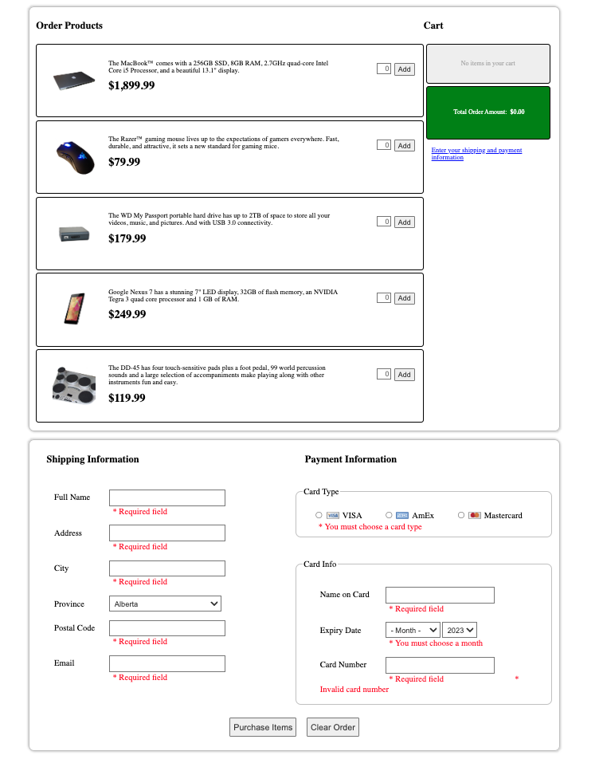

# Order form validation

[Link Demo](https://order-form-validation-f8qxtbfqt-khuongmai.vercel.app/)

Use JavaScript to validate the form before users submit to the server. The use of validation to ensure that all required form controls are filled out in the correct format. Client-side form validation helps ensure data submitted matches the requirements set forth in the various form controls.

A picture of a web order form

